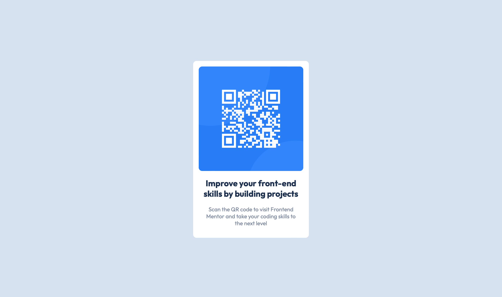

# Frontend Mentor - QR code component solution

This is a solution to the [QR code component challenge on Frontend Mentor](https://www.frontendmentor.io/challenges/qr-code-component-iux_sIO_H). Frontend Mentor challenges help you improve your coding skills by building realistic projects. 

## Table of contents

- [Overview](#overview)

  - [Screenshot](#screenshot)
  - [Links](#links)
  - [Built with](#built-with)

## Overview

Basic card using HTML and CSS.

### Screenshot

### Links

- Solution URL: https://github.com/z-mn/frontend-mentor-qr
- Live Site URL: https://z-mn.github.io/frontend-mentor-qr

### Built with

- Semantic HTML5 markup
- CSS custom properties
- Flexbox
- CSS Grid
- Mobile-first workflow